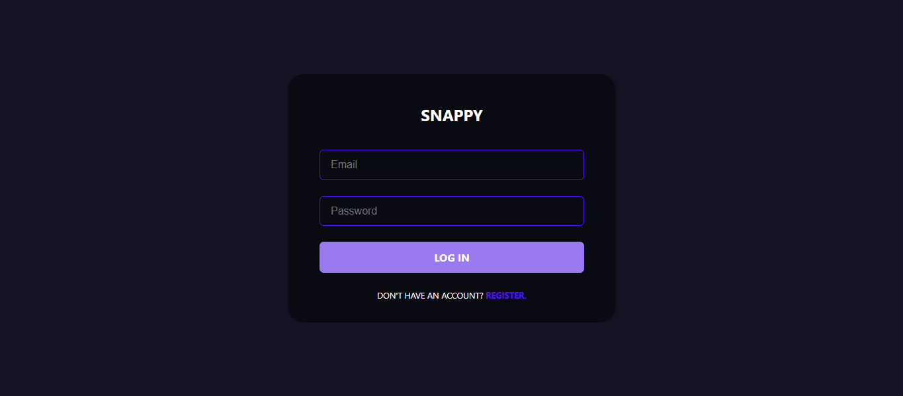
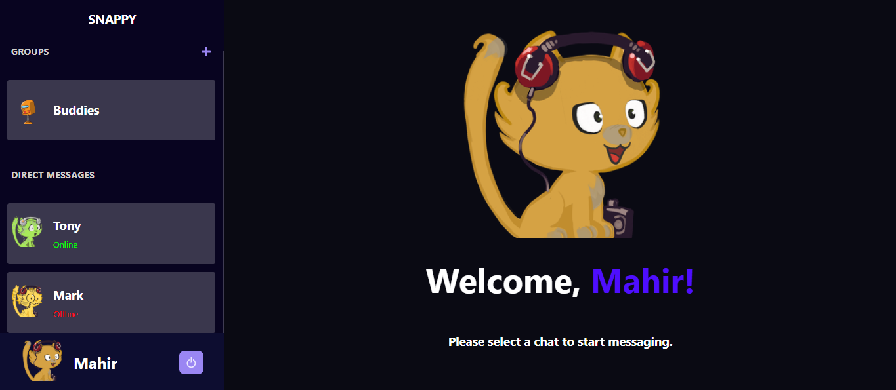

⚡ Snappy - Real-Time Chat Application

Snappy is a full-stack, real-time messaging application built to provide a seamless chat experience. It features instant messaging, group chats, media sharing, and live online status indicators, all wrapped in a premium interface.

🔗 Live Demo: snappy-woad.vercel.app

📸 Screenshots

<!--
INSTRUCTIONS:
1. Create a folder named 'screenshots' in your project root.
2. Add your screenshot files there named 'login.png' and 'chat.png'.
3. They will automatically appear below once pushed to GitHub.
-->

Login Screen

Chat Interface

✨ Key Features

🔒 Secure Authentication: User registration and login securely handled with JWT (JSON Web Tokens) and password encryption (Bcrypt).

⚡ Real-Time Messaging: Instant bi-directional communication using Socket.io.

🟢 Online Presence: Real-time Online/Offline status indicators for friends.

👥 Group Chats: Create named groups, add multiple members, and see sender identities.

📷 Media Sharing: Seamless image uploads powered by Multer and Cloudinary.

🤖 Dynamic Avatars: Unique, procedurally generated avatars using the Robohash API.

🗑️ Message Management: Ability to delete messages in real-time for both sender and receiver.

🎨 Modern UI: Responsive design built with React and Styled-Components.

🛠️ Tech Stack

Frontend

React.js (Vite): Fast, component-based UI library.

Styled-Components: For scoped, dynamic CSS styling.

Axios: Handling API requests.

Socket.io-Client: Managing WebSocket connections.

React-Toastify: For elegant notification popups.

Backend

Node.js & Express.js: RESTful API server.

MongoDB & Mongoose: NoSQL database for flexible data storage.

Socket.io: Enabling real-time event-based communication.

JWT & Bcrypt: For secure authentication and authorization.

Multer & Cloudinary: Handling file uploads and cloud storage.

⚙️ Environment Variables

To run this project locally, you will need to add the following environment variables to your .env file in the server directory.

server/.env

Variable

Description

PORT

The port the server runs on (e.g., 3001)

MONGO_URL

Your MongoDB Connection String (Atlas or Local)

JWT_SECRET

Secret key for signing JWT tokens

CLOUDINARY_CLOUD_NAME

Your Cloudinary Cloud Name

CLOUDINARY_API_KEY

Your Cloudinary API Key

CLOUDINARY_API_SECRET

Your Cloudinary API Secret

🚀 Installation & Local Setup

Follow these steps to get a local copy up and running.

1. Clone the Repository

git clone [https://github.com/Mahirjambhule/snappy.git](https://github.com/Mahirjambhule/snappy.git)
cd snappy

2. Backend Setup

Navigate to the server folder and install dependencies.

cd server
npm install

Start the server.

npm run dev

Server should run on http://localhost:3001

3. Frontend Setup

Open a new terminal, navigate to the client folder, and install dependencies.

cd client
npm install

Start the React app.

npm run dev

Client should run on http://localhost:5173

📂 Project Structure

snappy/
├── client/             # React Frontend
│   ├── src/
│   │   ├── components/ # ChatContainer, Contacts, Inputs...
│   │   ├── pages/      # Login, Register, Chat
│   │   ├── utils/      # API Routes configuration
│   └── ...
└── server/             # Node Backend
    ├── controllers/    # Logic for Auth, Messages, Groups
    ├── middlewares/    # Auth protection (JWT)
    ├── models/         # Mongoose Schemas
    ├── routes/         # API Endpoints
    └── index.js        # Server Entry Point

🔮 Future Improvements

Search Functionality: Filter contacts and messages.

Voice/Video Calls: WebRTC integration.

Message Reactions: React to specific messages with emojis.

Read Receipts: Double ticks when a message is read.

👤 Author

Mahir Jambhule

GitHub: @Mahirjambhule

Live App: snappy-woad.vercel.app

Made with ❤️ using the MERN Stack.